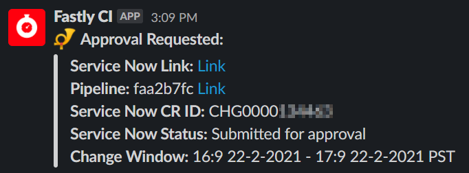

# fastly-framework ⏰

A Framework for Using Fastly with Terraform, Automation, and CICD

## About 💡

This project is an open source framework for creating a CICD pipeline with Terraform that builds Fastly services.

The CICD framework portion was created using GitLab-CI but it can be adapted to run with GitHub actions, CircleCI, and others.

Benefits:

* Using Git as a version control system for all Fastly changes
* Eliminate code reuse through shared VCL files, Snippets, and Terraform configuration blocks
* Test your services through a CICD pipeline before deploying them
* Integrate with chatops for deployments (Example: Slack)
* Quickly create new services from templates with `make service` - Using Jinja and Python
* Adopt *Infrastructure as Code* methodologies with Terraform
* Create your own pipeline stages for robust testing, alerts, approval, and much more

## Demos

### 1. Create a Merge Request

To kick off the pipeline, create a `merge request` with your changes. This demo will make changes to a `nonprod` and `prod` service as an example.

### 2. ChatOps Notification

Once your pipeline starts running, check Slack (or other messaging service if configured) for a notification that your MR has been created and the pipeline is now running.

### 3. Merge Request Pipeline

Check out your `merge request` pipeline to see how its doing. It will `plan` your changes with Terraform, `test` them with self configured tests, and then create an `approval` for deployment.

Note: `TFsec` will not be covered in this framework for simplicity. However, it is very easy to add on your own.

If you have the `slack` integration configured with `servicenow` you will recieve an alert like the one below for approval requests:

### 4. Merge Changes

Once your `merge request` pipeline passes you are free to merge your changes to the `main` or `master` branch. This will trigger the `deployment` pipeline!

### 5. Deployment Pipeline

This pipeline is triggered from a successful `merge` to `main`/`master` branches. The `deploy` stage is a manual action so you may deploy `nonprod` first to validate changes before deploying to `prod`. The `rapid-rollback` stage exists to revert your changes if something goes wrong.

If you have the `slack` integration configured you will recieve notification about successful deployments in Slack like the one below:

### 6. Rapid-Rollback

If something goes wildly wrong you can always rollback your changes via the `rapid-rollback` stage. Doing so will revert to the last active version in Fastly.

If you have the `slack` integration configured you will recieve a notification like the one below:

#### Large Job Support

The demo section above just shows two services running through the pipeline: `nonprod` and `prod` for example. However, the pipeline can support hundreds of concurrent jobs and for many services at once.

The example below shows many jobs running at once. They had testing errors so they failed and hence haulted the pipeline from continuing.

## Documentation 📚

### Table of Contents

Here is the table of contents for the documentation folder. See below for other doc links.

New to Fastly? The [Getting Started](docs/getting-started.md) doc is your place to start.

View the following documents for specific details around each subject:

* [getting-started](docs/getting-started.md) - The best place for newcomers
* [learning](docs/learning.md) - A guide for learning all things Fastly
* [fastly-to-insights](code/logs/fastly-to-insights/README.md) - Aggregated metrics collection from Fastly to New Relic
* [new-service](docs/new-service.md) - A guide for creating a new service in Fastly using this repo
* [pipeline](docs/pipeline.md) - General Pipeline framework information
* [rapid-rollback](docs/rapid-rollback.md) - Information about the rapid-rollback stage of the pipeline
* [slack](docs/slack.md) - For setting up Slack integrations with this pipeline
* [terraform-reference](docs/terraform-reference.md) - How to use common Terraform blocks to configure your Fastly service
* [vcl-include-and-snippets](docs/vcl-include-and-snippets.md) - Details about VCL include statements vs snippets. This guide has examples about how to use both and the key differences between them.

### Additional Documentation

The following links are to other doc pages and READMEs in this repo that are not in this specific folder.

* [ci folder details readme](/code/ci/README.md) - Details about the `/code/ci` folder
* [fastly-ci readme](/code/ci/docker/README.md) - Details about the stock CICD image with Terraform
* [logs folder readme](/code/logs/README.md) - Details about the logs folder

## Contributing

You are welcome to send pull requests to this repo. All and any contributors are welcome.
