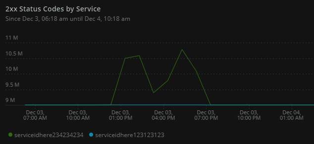
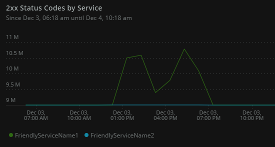

# Fastly to Insights 🚀

Maintained repo for this project available on [GitHub](https://github.com/GrantBirki/fastly-to-insights). Check it out for the latest information. One thing to note is that at the time of this writing, the maintained project does not include info on running in ECS with Terraform. You may follow either guide depending on what you are looking to accomplish (deploying to AWS ECS or building your own solution)

This is the New Relic blessed way to get your Fastly metrics into Insights, packaged as a Docker container image for ease of use!

In order to use the Fastly to Insights Docker image, you will need an active New Relic account with Insights, an active Fastly account with Read access, a New Relic Insights Insert key and a Fastly API Key.

## Quick Start

### Deploying to Prod

For deploying resources in this directory to production here are your options:

1. Edit the `.tf` files in the `infrastructure/` folder. This will change the infrastructure in AWS accordingly.
2. Adding a new Fastly service to the metrics collector aka `fastly-to-insights`

#### Adding a new Fastly Service

Adding a new Fastly service to be checked for metrics is very easy. Simply do the following:

1. Open `infrastructure/variables.tf` in a text editor
2. Update the `awsParamStore` value with your new resource.
3. Ensure that you append your value to the string seperated by a comma. Use the following format:

    ```text
    <serviceId1>:<serviceName1>,<serviceId2>:<serviceName2>, ...
    ```

    `serviceId` and the `serviceName` can be found in the Fastly console for your service. Or, you can check the artifact called `plan-apply.json` in the `Apply` stage of this pipeline to view both variables above. (Also appears as `plan.json` in the `Deploy` stage as well.)

4. Save your file, create a new branch, commit, and push changes to start a merge request.
5. Done!

### Using Docker-Compose (Preferred)

Using Docker-Compose to run this image is extremely easy.

Follow these steps to build and run the container locally.

1. Create a file named `creds.env` at the root of this repo with the following contents:

    ```dosini
    INSERT_KEY=XXXXXXXXXXXXXX
    ACCOUNT_ID=#######
    FASTLY_KEY=XXXXXXXXXXXXXXXXXXXXXXXXXXX
    ```

2. Add your services to `config.env`

    ```dosini
    ...
    SERVICES=ServiceName1:ServiceId1 ServiceName2:ServiceId2 ...
    ```

    Note: This only applies to running the Docker image locally. For prod please use the `ENV=AWS` environment variable. That is set via the `aws_ecs_task_definition` Terraform Resource.

3. Run: `sh build.sh`

4. ✔️ Log into New Relic and view your logs!

### Using Docker

Using Docker to build and run the container locally.

1. Build: `docker build -t fastly-to-insights .`
2. Run:

    ```bash
    $ docker run \
    -e ACCOUNT_ID='yourNewRelicAccountId' \
    -e FASTLY_KEY='yourFastlyKey' \
    -e INSERT_KEY='yourNewRelicInsertKey' \
    -e SERVICES='ServiceId1 ServiceId2 ...' \
    fastly-to-insights
    ```

## How to use this image

Before you get started, make sure that you have a [Fastly API Key](https://docs.fastly.com/guides/account-management-and-security/using-api-tokens) and a [New Relic Insert Key](https://docs.newrelic.com/docs/insights/insights-data-sources/custom-data/insert-custom-events-insights-api#register).

The Fastly to Insights image is configured by environment variables. These are mandatory:

* `ACCOUNT_ID`
* `FASTLY_KEY`
* `INSERT_KEY`
* `SERVICES`

These are optional:

* `SILENT` - Print output True/False
* `INTERVAL` - Interval in seconds to poll data from Fastly
* `ENV` - Set your environment to `LOCAL` or `AWS`. For prod ensure this is set to `AWS` to pull services from the AWS Parameter Store. This will default to `LOCAL` otherwise.

### Fastly Services

You have two options for passing in Fastly Services to the Docker container.

1. Passing in only the **ServiceId**
2. Passing in both the **ServiceId** and the **ServiceName**

Note: In both examples, one serivce has millions of 200s and the other has none.

#### 1. ServiceId

If you are just using the ServiceId method, `SERVICES` needs to be a string with the ids of the Fastly services you want to see data for in Insights, separated by a space. I know that's not ideal. A limitation of Fastly is that you have to query one service at a time, so I chose to create an array of service ids and loop through them to query Fastly. A limitation of Docker is that you can't pass an array via the command line, so I chose to split a string on " ". If you have a better idea, I would love to hear it - please contribute!

Example:

```bash
$ docker run \
  -e ACCOUNT_ID='yourNewRelicAccountId' \
  -e FASTLY_KEY='yourFastlyKey' \
  -e INSERT_KEY='yourNewRelicInsertKey' \
  -e SERVICES='ServiceId1 ServiceId2 ...' \
  fastly-to-insights
```

You may optionally add `-e SILENT=True` or `-e INTERVAL=<time in seconds>` for custom configuration.

Here is what this will look like in New Relic:



#### 2. ServiceId + ServiceName

If you want to map your ServiceId to a friendly name use this method. This method is the same as `1. ServiceId` above with one minor change. With this method `SERVICES` needs to be a string with the `<NameOfService>:<ServiceId>` of the Fastly services you want to see data for in Insights, separated by a space (Example below).

The benefit to using this method is you can name the service whatever you want. It could be a friendly name, the actual name of the service in Fastly, or your favorite planet.

Example:

```bash
$ docker run \
  -e ACCOUNT_ID='yourNewRelicAccountId' \
  -e FASTLY_KEY='yourFastlyKey' \
  -e INSERT_KEY='yourNewRelicInsertKey' \
  -e SERVICES='NameOfService1:ServiceId1 NameOfService2:ServiceId2 ...' \
  fastly-to-insights
```

You may optionally add `-e SILENT=True` or `-e INTERVAL=<time in seconds>` for custom configuration.

Here is what this will look like in New Relic:



Note: You can mix `method 1` and `method 2` together. In the `SERVICES` variable. I would not recommend doing this though

## New Relic Queries to View Data

Here are some helpful queries in New Relic to start viewing your metrics:

* 4xx Status codes by service

    ```sql
    SELECT sum(status_4xx) FROM LogAggregate since 6 hours ago TIMESERIES 3 minutes facet service
    ```

* 5xx Status codes by service

    ```sql
    SELECT sum(status_5xx) FROM LogAggregate since 6 hours ago TIMESERIES 3 minutes facet service
    ```

* 2xx Status codes by service

    ```sql
    SELECT sum(status_2xx) FROM LogAggregate since 6 hours ago TIMESERIES 3 minutes facet service
    ```

* The number of cache hits by service

    ```sql
    SELECT sum(hits) FROM LogAggregate since 6 hours ago TIMESERIES 3 minutes facet service
    ```

* The number of cache misses by service

    ```sql
    SELECT sum(miss) FROM LogAggregate since 6 hours ago TIMESERIES 3 minutes facet service
    ```

* The total amount of time spent processing cache misses (in seconds)

    ```sql
    SELECT sum(miss_time) FROM LogAggregate since 6 hours ago TIMESERIES 3 minutes facet service
    ```

To see more info on these queries, check out the blog post by New Relic [here](https://blog.newrelic.com/engineering/monitor-fastly-data/).

## Contributing

You are welcome to send pull requests to us - however, by doing so you agree that you are granting New Relic a non-exclusive, non-revokable, no-cost license to use the code, algorithms, patents, and ideas in that code in our products if we so choose. You also agree the code is provided as-is and you provide no warranties as to its fitness or correctness for any purpose.

## More Information

For more information on the Fastly Real-Time Analytics API, look [here](https://docs.fastly.com/api/analytics).

For more information on the New Relic Insights API, look [here](https://docs.newrelic.com/docs/insights/insights-data-sources/custom-data/insert-custom-events-insights-api).

This project is provided AS-IS WITHOUT WARRANTY OR SUPPORT, although you can report issues and contribute to the project.
