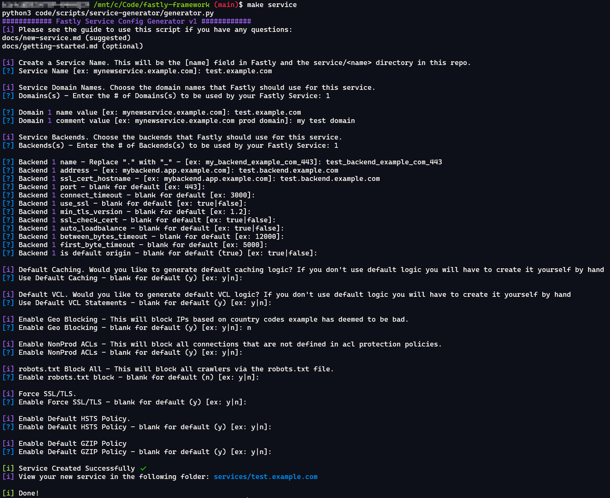

# Creating a new Fastly service 🆕

This page will guide you through creating a new Fastly service.

Here is a 10,000 foot overview of the steps needed:

1. Clone the `services/example` folder with your new service.
2. Add any necessary logic into your new `fastly.tf` and `fastly.vcl` files.
3. Update your `config.tf` file with Terraform state path.
4. Update the `.gitlab-ci.yml` file.
5. Attach a TLS certificate to your service in the console.

## Automated Creation (best) ⭐

This will create the most basic Fastly Service via a CLI script.

The quickest and easiest way to generate a service folder and service configuration is via the automated method. The automated method doesn't do everything for you but it is a great start for a baseline service. You will still need to create TLS certs (if needed) and manually tweak your configuration (if needed). The automated method creates a new `services/<your-new-service-name>` folder based on your input and a Jinja template. To actually deploy this service you will need to run it through your pipeline.

Dependencies:

* Python 3.x - [Download](https://www.python.org/downloads/)
* Jinja2 - [Link](https://pypi.org/project/Jinja2/)
* Make - [How to install](https://www.google.com/search?q=how+to+install+make)

Usage:

1. From the root of the repo run `make service`
2. Follow the CLI prompts to configure your service
3. Done!

This will create the following files under `service/<your-new-service-name>` with your chosen settings:

* `config.tf`
* `fastly.tf`
* `fastly.vcl`

If you wish to get a better understand about what is created through the automation or you need custom configuration, please read through the rest of this guide.

Note: You may also find it helpful to checkout the [vcl-include-and-snippets](vcl-include-and-snippets.md) guide to see how different Shared VCL and Snippet statements are used from the automated generation.

### Create a new Fastly Service Demo

Here is a screenshot of the `make service` command being run to create a new Fastly service.



## Manual Creation (good for learning) 📚

Follow the numbered steps below to create a service via the pipeline manually.

### 1. Create a new service folder

1. Clone this repo to your local machine
2. Enter into the `services/` directory of this project.
3. Copy and paste either `example` folder into the `services/` directory and give it a new and unique name that matches your service. Make sure this name is unique and the name you choose final. It is difficult to change this name after you create it so ensure it is meaningful! (due to altering the TF state)
4. Enter into your new service folder. You should see the following files:

    * `config.tf` - S3/AWS backend config
    * `fastly.tf` - Fastly service config
    * `fastly.vcl` - Custom Fastly VCL

5. You will need to edit the following files with your service information like so:

    * `config.tf`: `"fastly/services/example/terraform.tfstate"` -> `"fastly/services/your-service-name/terraform.tfstate"`
    * `fastly.tf`: This entire configuration is up to you. Notes: `activate` must be set to `false` and you must leave in the ID Comments (`#ID0001` etc)

        For more details on configuring the Terraform for your Fastly service please see the following guide - [Link](terraform-reference.md).
        Note: It is **highly** encouraged to read the Terraform reference as it will walk you through all the common Fastly Terraform blocks.

    * `fastly.vcl`: If you need custom VCL you may edit this file in anyway necessary. It is simply a base file in the `example` folder
    * Feel free to also use `includes` statements in your VCL with any of the "common vcl code". You may also used the "common TF variables" Using this code is covered in a seperate document available here -> [Common Code](common-code.md) or [Terraform Reference](terraform-reference.md).

6. Now that your service folder and subfiles are created you can move onto editing the CICD pipeline configuration.

### 2. Update the GitLab CI file

1. Open the .gitlab-ci.yml file in a text editor (sublime, vsc, etc). Just ensure it can interpret YAML.
2. Copy *everything* in the `Example Template Section` and paste at the bottom of the file. Example:

    ```yml
    Start of file
    ...
    ..
    .

    # ----------- EXAMPLE TEMPLATE SECTION -----------
    ...
    [copy everything in here]
    ...
    # ------------------------------------------------

    ...
    ..
    .

    -> [Paste it here]
    End of file
    ```

3. Edit the pasted code according to the in-line comments. Examples:

* `# ----- Example Service -----` -> `# ----- Your New Service -----`
* `plan:example:` -> `plan:your-new-service`
* `test:example:` -> `test:your-new-service`
* `apply:example` -> `apply:your-new-service`
* `deploy:example` -> `deploy:your-new-service`
* `rapid-rollback:example` -> `rapid-rollback:your-new-service`
* `services/example/*` -> `services/your-new-service/*`

### 3. About Terraform

In order to make service folders and files as clean and reusable as possible, this framework uses Terraform variables files.

These variables files have defaults defined for many Fastly service features. For example, you can use the common `OriginDefaults`, `HealthCheckDefaults`, or shared logging config `FastlyLogs` variable to make life easier.

There are two files which will be copied into your config folder during the pipeline build. These files are `code/terraform/variables.tf` and `code/terraform/versions.tf`.

* `variables.tf` contains common/shared/default variables which you can use in your `fastly.tf` file.
* `versions.tf` defines the Terraform + Fastly TF version to use during build.

NOTE: Changing either of these shared `.tf` files will effect every service using them. One small change can have a huge effect so be very careful with these.

### 4. Updating TLS Certificates in the console

You may or may not have to complete this step.

You do **not** need a TLS cert if your new service domain is covered under a certificate that already exists in Fastly.

For example, if you have a certificate that covers `*.example.com` and your new service is `app.example.com` your new service domain can use this certificate.

If your hostname is not covered by an existing certificate you **will** need to create a new TLS cert for your domain/service.

#### Create a new TLS Certificate 🔐

See the Fastly [TLS Service Options](https://docs.fastly.com/products/tls-service-options) for more details.

Security Advisory:

* Use 4096 bit keys
* Use PFS ciphers
* Use TLS 1.2 or greater

### 5. Important Notes

This section contains important notes which you should note and be aware of before creating a service.

* After you have created a service please do not change the service/foldername. This can have unintended consequences. Please review the pipeline stages and how folder names are used before doing so.
* Any changes to the "common files" can effect all services within Fastly. Be very careful when making changes to these files: `terraform/*`, `vcl/*`, `snippets/*`, `logs/*`.
